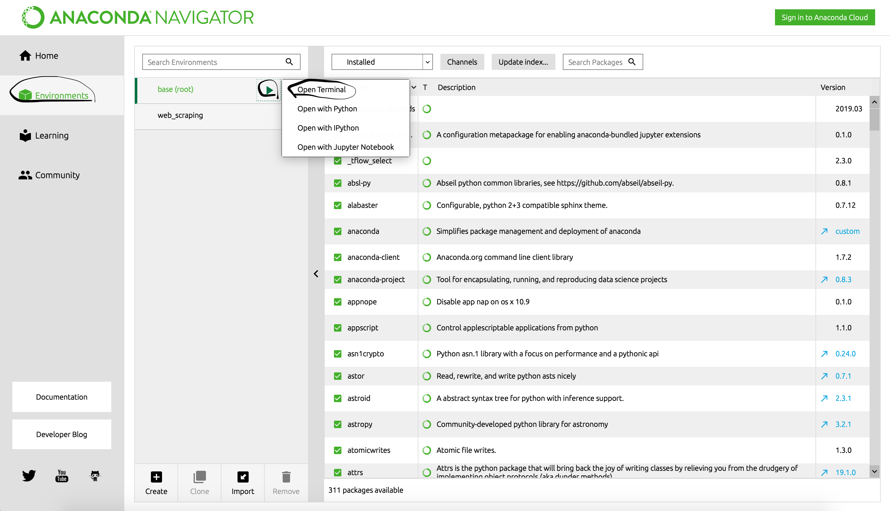

# upwork_scraper

## Project Title

Scrapy spider which scrape Upwork website under certain keywords for higher budget jobs.

## Prerequisites
##### Python 3.7 or later
##### Scrapy 1.6.0 or later

## How to install prerequisites

### If you don't have python:
#### Firstly, install anaconda nagivator.
1) Follow the link: "https://www.anaconda.com/distribution/".
2) Choose your operational system and install anaconda for python 3.7 or later.
3) Here are the links for tutorials: https://docs.anaconda.com/anaconda/install/, https://www.youtube.com/watch?v=6LXwdjdACWM

#### Secondly, install Scrapy.
1) Open anaconda navigator.
2) Go to environments.
3) Press "play" button and open terminal.
4) In terminal type: *conda install scrapy*

### If you already have python:
#### Just install scrapy:
1) Open terminal
2) Type: *pip3 install scrapy*

## Running a spider
#### To run spider you just have to download project and execute *runner.py* file

1) Download project
2) Open terminal
3) Go to project root directory
4) From project root directory type in terminal: *python3 runner.py*
5) You will see the following window

- Enter key word and press enter (just press enter if you want to scrape all the jobs)
- Enter min budget and press enter (if you just press enter, you will set buget to 0)
- Enter max post date in days (just press enter if you don't want to set upper limit for max post date)
- Enter max number of scraped jobs and press enter (just press enter if you don't want to set upper limit for number of jobs to scrape)
#### Enter "key words" without mistakes !!!

6) When spider finish scraping, you will see the following window.

7) Scraped jobs are located in csv file in the same directory as project.

